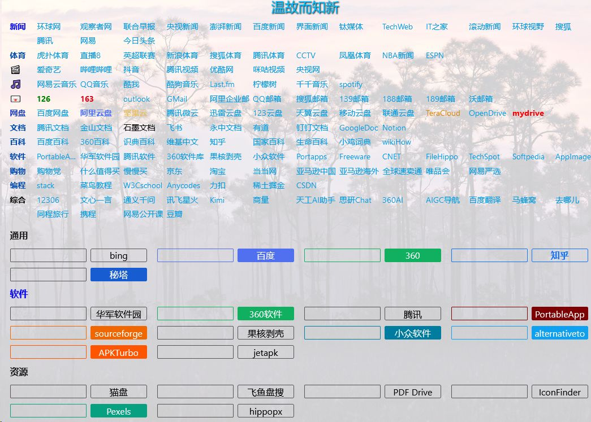

# webnav2 说明

[English](README_en.md)

webnav2 是基于 wikidocs 的网址导航和资料搜集系统，它小巧快速，使用简单，维护方便，容易定制，可以安装到虚拟主机、普通计算机、机顶盒、树莓派、安卓手机，支持 Linux、Windows、android 等系统，甚至可以作为windows便携软件，放在 U 盘或移动硬盘中使用。



## 1. 系统功能

除了 wikidocs 原有的功能外（markdown 创建、编辑、历史版本、搜索等），增加了一些实用功能：

- 统计 📝文件数和 🖼️图片数
- 📊 统计每个页面访问次数
- 📊 统计整个系统每日、昨日、本周、本月、今年、所有访问次数
- 🔀 随机打开一个已有页面
- 📒 最近访问页面
- ⚙️ 可灵活配置的搜索引擎、网址导航、每日格言。
- 可以自定义页面特效（JS）
- 可以设置页面背景
    - 可以使用任意图片做为背景
    - 可以使用必应每日墙纸做背景
    - 可以自动保存每日必应墙纸

## 2. 下载

程序可以在 github 或者 gitee 上下载：

* [🐈︎ github](https://github.com/shaoziyang/webnav2)
* [🐎 gitee](https://gitee.com/shaoziyang/webnav2)

## 3. 安装说明

系统的安装很简单，只需要一个带有 apache/nginx + php 的服务器即可，占用资源很少。

### 3.1 环境要求

系统需要的资源非常低，基本需求是：

- apache2/nginx 服务器，开启 rewrite 功能
- php 7.4 以上版本

系统已经在多个不同的 Linux（包括armbian）、安卓、windows 软硬件环境中进行了测试。

### 3.2 安装

在不同系统环境下的安装方式大同小异，主要就是将下载的文件解压缩到服务器的某一目录或子目录，然后进行参数配置。


#### 3.2.1 通用版本

- 从 github 或 gitee 下载文件
- 将压缩文件解压到服务器某一目录或者子目录中（比如解压到 nav 目录下）
- 打开浏览器，输入目录对应的网址（比如 [http:\/\/域名/nav]()），第一次运行时会进行初始化
	- 如果初始化后改变了系统的目录（如目录改名或移动到新目录），需要先删除`datasets/config.inc.php`文件，然后再次初始化
- 根据模板，配置（自定义）搜索、导航、每日格言、系统背景、js特效等，多种功能可以组合使用
- 将导航系统网址加入浏览器书签或收藏夹，方便随时使用

#### 3.3.2 在安卓手机📱上安装

在安卓手机上运行随心导航，可以作为随身服务器，小巧方便，随处可用。如果配合可道云、Alist等软件，会更加方便。基本原理就是先在安卓手机上安装 apache / php 服务器，然后再使用[随心导航](https://github.com/shaoziyang/webnav2)系统。实现方式有多种，下面介绍使用开源的 termux 进行安装的方法： 

- 先安装 [Termux](https://termux.dev/en/)
	- 正常情况需要安卓7.0以上版本，安卓5/6上参考[官方wiki说明](https://github.com/termux/termux-app/wiki/Termux-on-android-5-or-6)进行安装
	- 安装后先进行更新和升级
```
apt update
apt upgrade
```
  - 如果下载速度较慢，可以换源 `termux-change-repo`
- 在 Termux 中安装 ssh，方便通过远程访问（主要是为了在pc上输入命令）
	- `apt install openssh`
	- 配置 openssh
		- 用 `ssh-keygen -A` 生成ssh密钥
		- 运行 `sshd`，如果可以成功启动就说明安装成功
	- 用 `whoami` 查看用户名并记录（termux中不能修改和添加用户）
	- 用 `passwd` 设置密码
	- 在 pc 上使用 mobaxterm/putty 等软件用上面的用户名和密码通过 ssh 远程连接（注意默认端口号是 8022 而不是 22），后面就不用在手机上输入命令了。
- 在 Termnux 中安装系统服务，方便管理，而且运行 Termux 后可以自动启动相关服务。
	- `apt install runit termux-services busybox`，安装后需要重新启动一次 termux （退出后重新运行），才能使服务功能生效
	- 启用 sshd 服务：`sv up sshd`
	- 自动启动 sshd：`sv-enable sshd`
- 安装 apache2 服务器
	- 安装：`apt install apache2`
	- 配置：`nano $PREFIX/etc/apache2/httpd.conf`，设置`DocumentRoot`、`Listen` 等参数，注意在没有 root 情况下，端口号要大于 1000。
	- 启动服务器：`httpd`
	- 其它：
		- 启动httpd系统服务：`sv up httpd`
		- 自动启动系统服务：`sv-enable httpd`
		- 停止httpd服务：`sv down httpd`
- 安装 php
	- `apt install php php-apache php-fpm`
	- 通常不用修改参数，如果需要修改参数，运行：`nano $PREFIX/lib/php.ini`
- 再次配置 apache：`nano $PREFIX/etc/apache2/httpd.conf`
	- 载入 php 解释器（添加一行）：`LoadModule php_module libexec/apache2/libphp.so`
	- 添加 php 文件支持（添加一行）：`AddType application/x-httpd-php .php`
	- 添加 php 文件名解析，找到`<IfModule dir_module>`，在 index.html 后添加 `index.php`：
    ```
    <IfModule dir_module>
        DirectoryIndex index.html index.php
    </IfModule>
    ```
    - 重启httpd服务 `sv restarrt httpd`
- 解压并复制**随心远航**系统到 apache2 服务器的文件目录下（`DocumentRoot` 中设定的目录）
- 运行浏览器，打开**随心远航**对应网址，进行参数配置

---

⚡
- 可以通过 tailscale 等软件实现设备间通过设备名称方式访问（MagicDNS）和跨网络访问，避免网络变化时带来的不便。
- 可以通过 cpolar / frp 等软件实现内网穿透，实现广域网访问。

#### 3.3.3 🖫便携版使用说明

便携版是使用了类似 portable app 的方式，将 windows 版本（64位）的迷你（精简） Apache2、php 服务器软件和随心远航系统打包在一起，可以放在U盘、移动硬盘等设备中使用。

使用时，只需要将文件解压缩并复制到任意目录，然后运行其中的 `sxyhPortable.exe`。

此便携版本默认全部使用了 64 位程序，如果需要使用 32 位版本程序（例如在 32 位 windows 上运行），请自行替换软件和扩展模块为 32 位版本。


##### 便携版软件目录结构

```
便携版软件目录
    |
    |--  home              用户主页
    |      |--  nav2       随心远航系统
    |      
    |--  server            服务器软件目录
    |      |--  a2.4.57_p8.2.10  迷你服务器（ Apache 2.4.57 + php 8.2.10 ）
    |            |--  conf       apache2 服务器配置
    |            |--  logs       apache2 日志文件
    |            |--  tmp        服务器临时文件目录
    |            |--  modules    apache 的 模块
    |            |--  php        php 软件目录
    |                  |--  ext  php 的模块
    |
    |--  sxyhPortable.exe，便携软件主文件
    |--  sxyhPortable.ini，便携软件配置
```

##### 便携软件配置

便携版软件的配置在文件`sxyhPortable.ini`中，是一个标准的ini文件，用任意文本编辑器打开它就可以设置。主要配置参数如下：

```
[server]
apache=server\a2.4.57_p8.2.10\httpd.exe

[browser]
app=..\tools\SeaMonkeyPortable\SeaMonkeyPortable.exe
;app=
open_browser=1
```

- `[server]` 下的 `apache=server\a2.4.57_p8.2.10\httpd.exe` 设置 apache 服务器的主文件名，这里需要使用相对路径。如果改变了服务器目录，需要将这个参数做对应修改。
    - 可以存放多个不同版本服务器软件在 server 目录下的不同子目录，通过 ini 文件快速切换。
- `[browser]` 下的 `app=..\tools\SeaMonkeyPortable\SeaMonkeyPortable.exe` 设置浏览器文件名，通常指定一个和便携版软件在相同磁盘的便携版浏览器，如SeaMonkeyPortable、FirefoxPortable、EdgePortable、百分浏览器等。如果不指定文件名，将使用系统默认浏览器。
- `[browser]` 下的 `open_browser` 代表是否在软件运行时自动打开上面设置的浏览器，如果是 1 将打开浏览器，如果是 0 将不打开。

##### 迷你服务器配置

迷你服务器的配置和标准服务器是一样的，只是需要配置的参数少很多。

- apache2

    Apache2 服务器只保留了最基本的文件和模块，所有配置也更加简单，只需要配置很少几个参数。Apache2 的配置文件在 `server\a2.4.57_p8.2.10\conf\httpd.conf`。

    - `Listen 8800`，配置端口号，默认使用了 8800，可以修改为不与系统冲突的任意有效端口号。
    - `DocumentRoot ../../home`，设置服务器主页目录。
    - `LoadModule php_module php/php8apache2_4.dll`，指定 php 模块对应的 DLL 文件。

    其它参数可以参考 apache 软件的文档，通常无需修改，使用默认值就可以。


- php

    php 软件在 `server\a2.4.57_p8.2.10\php` 下，配置文件是 `server\a2.4.57_p8.2.10\php\php.ini`。

    一般情况下，不需要修改 `php.ini` 就能正常使用。如果需要增加或修改扩展模块，可以将文件复制到 `php\ext` 目录下，然后在 `php.ini` 中添加或修改 `extension=xxxx`。

##### 升级服务器软件

Apache2 和 PHP 软件都会定期更新，可以自行下载最新的服务器软件，提取其中相应的文件，替换旧版本文件，就可以完成升级。

- [Apache2](https://httpd.apache.org/) 的官网不直接提供编译后的二进制文件，升级的一种方式是自行编译源码，另一种方式是从第三方网站下载。官网推荐的下载网站有：
    - [ApacheHaus](https://www.apachehaus.com/cgi-bin/download.plx)
    - [Apache Lounge](https://www.apachelounge.com/download/)
    - [Bitnami WAMP Stack](https://bitnami.com/stack/wamp)
    - [WampServer](https://www.wampserver.com/)
    - [XAMPP](https://www.apachefriends.org/en/xampp.html)
- [PHP](https://php.net/) 在官网就可以直接下载升级文件。PHP 分为 `Non Thread Safe` 和 `Thread Safe` 版本，通常 Apache2 使用 Thread Safe 版本。


**注**
- 迷你服务器借鉴了 [dokuwiki](https://download.dokuwiki.org/) 中的 MicroApache 服务器，更新和增加了部分文件。

### webnav2 目录结构

```
webnav2 文件目录
   |- styles：系统 CSS 配置
   |- documents/documents：用户数据目录
   |- documents/documents/homepage/config：系统配置主目录
                                     |--  nav: 网址导航配置
                                     |--  images: 系统墙纸库
                                     |--  search: 搜索引擎配置
                                     |--  dailymotto: 每日格言配置
                                     |--  javascript: javascript 脚本库

```

## 4. 🧰系统维护说明

基本不需要特殊维护，定期备份一下数据目录（`datasets/documents`）就可以了。如果修改了`styles-custom.css`用户样式表文件，也需要备份一下。

数据目录下的文件和目录可以用任何软件复制、移动、修改，修改后，系统会自动更新。

## 5. 使用说明

随心远航系统是基于 wikidocs 二次开发的，基本使用方法和 wikidocs 类似，但是添加了很多新的功能：

- 页面计数 *：统计每个页面的访问次数
- 站点计数 *：统计今天、昨天、本周、本月、今年、总共访问次数 
- 文件统计 *：统计页面和图像文件数量
- 随机页面：随机打开一个已有的页面
- 最近访问：查看最后访问的页面
- 网址导航：简单配置就可使用的分类网址导航
- 搜索引擎：简单配置就可使用的搜索引擎，直接从本机开始搜索
- 每日格言：可自定义的每日格言
- 系统背景：可以设置不同图像文件作为页面背景
- javascript：可以使用各种javascript脚本增强页面效果

标有*号的功能需要登录后才能查看

### 5.1 系统配置

系统可以根据需要灵活配置，在任何的页面显示导航、搜索、每日格言、设置背景、添加 js 效果等等，甚至还可以自己编写 js 脚本实现更多效果。

每种功能可以通过编辑对应的模板，就可以简单、快速实现各种功能，不同模块还可以组合使用，设计出适合个人的功能。

### 5.2 配置每日格言

编辑 `datasets/documents/homepage/config/dailymotto/content.md` 文件（可以使用系统自带编辑器或者任何外部编辑器），可以添加、修改、删除格言，修改显示样式。

- 每行代表一个格言
	- 有效的格言是以`-`或`*`开头，也就是无序列表样式，其它的行将被忽略。
	- 每行格言可以用符号`|`分成多个部分，第一部分是格言内容，第二部分是格言提示，第三部分是格言样式参数（只对此格言生效）。
- 系统将每日自动选择一个格言。
- 在需要的地方，使用 `<script>SXYH_ShowDailyMotto();</script>` 显示每日格言（<font color="orange">`<script>` 标签最好放在每行最前面，避免和其它功能冲突</font>）。
- 在用户自定义样式表 `styles/styles-custom.css` 中，通过 `.SXYH_DiaryMotto` 和 `.SXYH_divDiaryMotto` 修改每日格言的默认大小、颜色、字体等样式。
	- 在 SXYH_ShowDailyMotto(style) 中通过 style 参数修改指定样式，如`SXYH_ShowDailyMotto("font-size:2em;color:green;text-shadow: 2px 2px 4px black;");`。
	- 样式优先级为：格言样式参数 > 函数参数 > 默认样式

每日格言模板：
```
* 所有过往，皆为序章。
* 千里之行始于足下
* 天行健，君子以自强不息。
* 路曼曼其修远兮，吾将上下而求索。
* 绳锯木断，水滴石穿。
* 海纳百川，有容乃大；壁立千仞，无欲则刚。
* 见贤思齐焉，见不贤而内自省也。
* 三人行，必有我师焉，择其善者而从之，其不善者而改之。
* 二人同心，其利断金
* 满招损，谦受益。
* 欲穷千里目，更上一层楼。
* For man is man and master of his fate.|人就是人，是自己命运的主人
* A lazy youth, a lousy age.| 少壮不努力，老大徒伤悲。
* Do one thing at a time, and do well.|一次只做一件事，做到最好！
* Youth means limitless possibilities.|年轻就是无限的可能。
* Knowledge makes humble, ignorance makes proud.|博学使人谦逊，无知使人骄傲。
* If winter comes , can spring be far behind ?|冬天来了，春天还会远吗？
* Sharp tools make good work.|工欲善其事，必先利其器。
* Journey of a thousand miles begins with single step.|千里之行，始于足下。
* Failure is the mother of success.|失败乃成功之母。
* Suffering is the most powerful teacher of life.|苦难是人生最伟大的老师。
* I am a slow walker,but I never walk backwards.|我走得很慢，但是我从来不会后退。
* Where there is a will, there is a way.|有志者事竟成。
```

### 5.3 配置网址导航

编辑 `datasets/documents/homepage/config/nav/content.md` 文件（可以使用系统自带编辑器或者任何外部编辑器），可以添加、修改、删除网址导航和分类，修改样式。

- 文件中每一行代表一个分类或者网址
    - `- 新闻` 代表分类。
    - `- 环球网| https://www.huanqiu.com/` 代表网址。
    - `- 126| https://126.com/|| color:green;font-weight:bold;` 代表自定义样式网址
- 有效的数据是以`-`或`*`开头，也就是无序列表样式，其它的行将被忽略。
- 每行数据可以用符号`|`分成多个部分
	- 第一部分是分类名称或者网址名称。
	- 第二部分如果是链接，就代表是网址，否则代表分类。
	- 第三部分是网址提示。
	- 第四部分是自定义网址样式，如：`color:#5174FD;font-weight:bold;`。
- 在需要的地方，使用 `<script>SXYH_ShowNav();</script>` 显示网址导航。
- 在用户自定义样式表 `styles/styles-custom.css` 中，通过 `.sxyh_nav_xxxx` 修改默认的大小、颜色、字体等样式。
	- 样式优先级为：网址样式参数 > 默认样式

网址导航模板
```
- 新闻||网站|color:blue
	- 环球网| https://www.huanqiu.com/
	- 观察者网| https://www.guancha.cn/
	- 联合早报| http://www.quzaobao.com/
	- 央视新闻| https://news.cctv.com/china/
	- 澎湃新闻| https://www.thepaper.cn/
	- 百度新闻| https://news.baidu.com/
	- 界面新闻| https://www.jiemian.com/
	- 钛媒体| https://www.tmtpost.com/
	- TechWeb| https://www.techweb.com.cn/
	- IT之家| https://www.ithome.com/
	- 滚动新闻| https://www.chinanews.com/scroll-news/news1.html
	- 环球视野| https://tophub.today/n/yjvQy54vbg
	- 搜狐| https://www.sohu.com/
	- 腾讯|https://www.qq.com/
	- 网易|https://fwww.163.com/
	- 今日头条|https://www.toutiao.com/
- 体育
	- 虎扑体育| https://www.hupu.com/
	- 直播8| https://www.zhibo8.cc/
	- 英超联赛| https://sports.qq.com/premierleague/
	- 新浪体育| https://sports.sina.com.cn/
	- 搜狐体育| https://sports.sohu.com/
	- 腾讯体育| https://sports.qq.com/
	- CCTV| http://sports.cntv.cn/
	- 凤凰体育| https://sports.ifeng.com/
	- NBA新闻| https://sports.qq.com/nba/index.shtml
	- ESPN| https://www.espn.com/
- 🎬|color:#C00080
	- 爱奇艺| https://www.iqiyi.com/
	- 哔哩哔哩| https://www.bilibili.com/
	- 抖音|https://www.douyin.com
	- 腾讯视频| https://v.qq.com/
	- 优酷网| https://www.youku.com/ 
	- 咪咕视频| https://www.miguvideo.com/
	- 央视网| https://tv.cctv.com/
```

### 5.4 配置搜索引擎

编辑 `datasets/documents/homepage/config/search/content.md` 文件（可以使用系统自带编辑器或者任何外部编辑器），可以添加、修改、删除搜索引擎和分类，修改显示样式。


下面是一个典型搜索引擎配置：

```
- 通用
	- bing| https://cn.bing.com/search?q=%1||background-color:transparent;|background-color:transparent;
	- 百度| https://www.baidu.com/s?wd=| 搜索关键字| border-color:#5070F0;color:#5070F0;| border-color:#5070F0;background:#5070F0;color:white;
	- 360| https://www.so.com/s?q=| 360搜索| border-color:#10B060;color:#10B060;| border-color:#10B060;background:#10B060;color:white;
    - 秘塔| https://metaso.cn/?q=|||border-color:#175CD1;background:#175CD1;color:white;
- 软件||||color:blue;
    - 华军软件园| https://www.onlinedown.net/search?searchname=%1&button=搜索
	- 360软件| https://baoku.360.cn/soft/search?kw=||border-color:#10B060;color:#10B060;| border-color:#10B060;background:#10B060;color:white;
```	

- 文件中每一行代表一个分类或者搜索引擎，如：
	- `- 软件` 代表分类。
	- `- bing| https://cn.bing.com/search?q=` 代表搜索引擎。
	- `- 百度| https://www.baidu.com/s?wd=| 搜索关键字| border-color:#5070F0;color:#5070F0;| border-color:#5070F0;background:#5070F0;color:white;` 代表自定义样式搜索引擎。
- 有效的数据是以`-`或`*`开头，也就是无序列表样式，其它的行将被忽略。
- 每行数据可以用符号`|`分成多个部分
	- 第一部分是分类名称或者搜索引擎名称。
	- 第二部分如果是链接，就代表是搜索引擎，否则代表分类。
		- 链接中如果有`%1`，就代表输入的关键字；否则输入关键字放在链接的最后。
		- 链接可以通过搜索引擎获取，如：
			- 必应：`https://cn.bing.com/search?q=abc`，abc是搜索关键字，前面的`https://cn.bing.com/search?q=`就是搜索链接。
			- 百度：`https://www.baidu.com/s?wd=123`，123是搜索关键字，前面的`https://www.baidu.com/s?wd=`就是搜索链接。
	- 第三部分是输入栏提示。
	- 第四部分是输入栏样式，样式格式为CSS参数，用于改变默认的样式。如：
		- `border-color:#175CD1;background:#175CD1;color:white;` 代表边框颜色#175CD1，背景颜色#175CD1，字体白色。
	- 第五部分是按钮样式，含义同上。
- 在需要的地方，使用 `<script>SXYH_ShowSearch();</script>` 显示网址导航。
- 在用户自定义样式表 `styles/styles-custom.css` 中，通过 `.sxyh_search_xxxx` 可以修改默认的大小、颜色、字体等样式。
	- 样式优先级为：搜索样式参数 > 默认样式。

### 5.5 配置系统背景

可以使用任何本地图片或网络图片作为页面背景。在需要使用背景的页面中，用下面方式添加背景（每次刷新后显示随机背景）：

```
<script>SXYH_setwallpaper("");</script>
```

`SXYH_setwallpaper(img="", opacity=0.8, size="cover")` 的参数说明：

- `img`: 代表图像文件，支持jpg、png、webp、svg等多种图像格式，可以设置多种参数
	- `"xxx.jpg"`，代表页面同一目录下的图像文件。
	- `"xx/xx/xx.png"`，指定目录的图像文件。
	- `"https://xxxx.xxxx.xxxx/xx.webp"`，指定网络文件。
    - `{{IMG_LIB}}xx.jpg`: 图像库中的文件。
	- `""` 或 `RANDOM"`，代表随机显示系统图像库（[`datasets/documents/homepage/config/images`]({{APP_PATH}}homepage/config/images) 目录）中的图像文件。
	- `"DAY"`，随机显示（一天内相同） 系统图像库（[`datasets/documents/homepage/config/images`]({{APP_PATH}}homepage/config/images) 目录）中的图像文件。
	- `"BING"`，用必应每日一图作为背景。
	- `"BING_AUTOSAVE"`，用必应每日一图作为背景，并保存图像到系统图像库。
- `opacity`: 代表图像不透明度，参数范围是[0-1]，数值越小代表越清晰，越大越模糊，默认是0.8。对于颜色较鲜艳的图像，不透明度过小会让页面中的内容不易看清，因此设置适当的不透明度可以既丰富页面效果又不会影响显示内容。
- `size`: 图像显示大小，默认是 “cover”，代表缩放背景图片以完全覆盖背景区，但是背景图片部分可能不可见。其它参数请参考CSS中相关说明。

### 5.6 配置 Javascript 脚本

在页面中可以配合使用 Javascript 脚本，实现各种特殊效果。

- 使用脚本时，和在html中使用脚本方式一样，如 `<script>脚本语句</script>` 或 `<script src="xxx"></script>`。可以载入本地脚本或者网络脚本，也可以直接嵌入完整的脚本代码。
- 也可以通过 `<script>SXYH_js(xx)</script>`方式载入脚本，它好处是可以通过多种方式使用位于系统脚本库 `datasets/documents/homepage/config/javascript` 中的脚本，在系统脚本库中已经集成了多个特效（如下雪、落花、下雨、洛伦兹曲线等）。
	- 使用 `<script>SXYH_js("RANDOM");</script>` 可以随机载入系统脚本库中的脚本。
	- 使用 `<script>SXYH_js("lorenz.js");</script>` 随机显示洛伦兹曲线效果。

