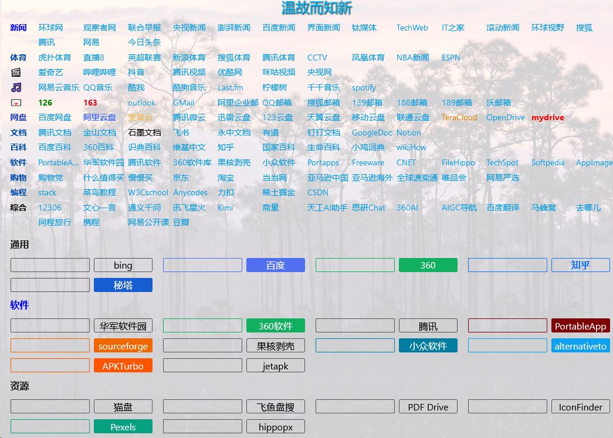

# webnav2

[中文说明](README.md)

**webnav2** is a website navigation and data collection system based on Wikidocs. It is compact, fast, easy to use, easy to maintain, and easy to customize. It can be installed on virtual hosts, regular computers, set-top boxes, Raspberry Pi, Android phones, and supports Linux, Windows, Android, and other systems. It can even be used as a Windows portable software, stored on USB drives or mobile hard drives.

## 1. System functions 

In addition to the original functions of Wikidocs (such as creating, editing, historical versions, searching, etc.), some practical features have been added: 

- Statistics 📝 Number of files and 🖼️ Number of images 
- 📊 Count the number of visits to each page 
- 📊 Count the daily, yesterday, this week, this month, this year, and all visits of the entire system 
- 🔀 Randomly open an existing page 
- 📒 Recently visited pages 
- ⚙️ Flexible search engine configuration, website navigation, and daily quotes. 
- Customizable page effects (JS) 
- Set image as page background 
    - Can use any image as the background 
    - Can use Bing Daily Wallpaper as background 
    - Can automatically save daily Bing wallpapers 

## 2. Download 

The program can be downloaded on GitHub or Gitee: 
- 🐈 Github 
- 🐎 Gitee 

## 3. Installation instructions 

The installation of the system is very simple, only Apache/nginx + PHP is needed, which occupies very little resources.

### 3.1 Environmental requirements 

The resources required by the system are very low, and the basic requirements are: 

- Apache 2/nginx server, enable rewrite function 
- PHP version 7.4 or above 

### 3.2 Installation 

The installation methods in different system environments are similar, mainly by extracting the downloaded files to a directory or subdirectory on the server, and then configuring the parameters.

## 4. System maintenance
 
There is basically no need for special maintenance, just regularly backup the data directory (datasets/documents). 

## 5. Usage
 
The webnav2 is based on Wikidocs, and its basic usage method is similar to Wikidocs, but it has added many new features: 

- Page view count *: Counts the number of visits to each page 
- Site view count *: Counts the total number of visits made today, yesterday, this week, this month, this year, and so on 
- File statistics *: Counts the number of pages and image files 
- Random page: Randomly open an existing page 
- Recent pages: View the last visited pages 
- Website navigation: A classification website navigation that can be easily configured and used 
- Search engine: start to searching directly from the local machine 
- Daily quotes: customizable daily quotes 
- System background: Different image files can be set as page backgrounds 
- JavaScript: Various JavaScript scripts can be used to enhance page effects 

The functions marked with * need to be logged in to view

